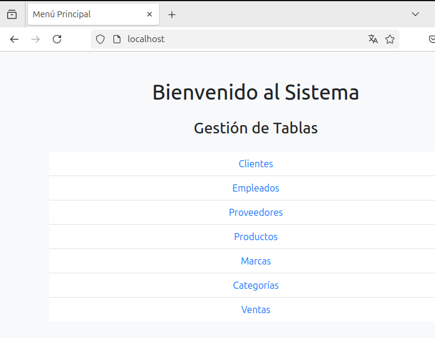
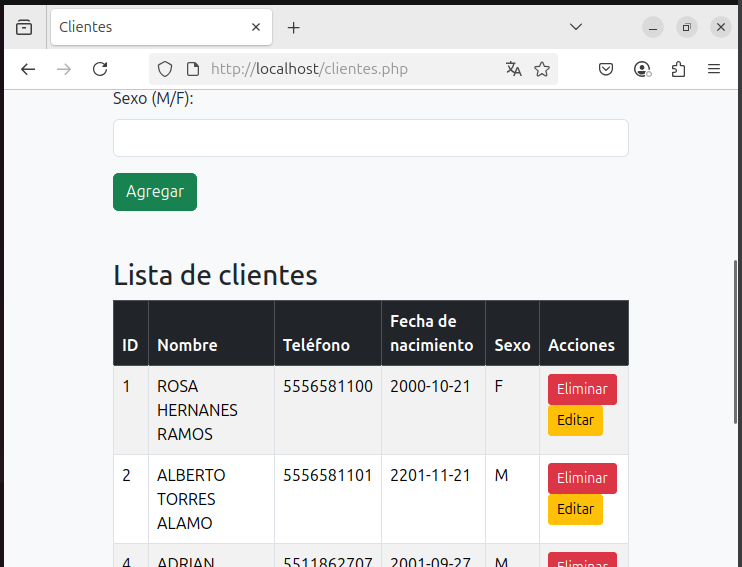
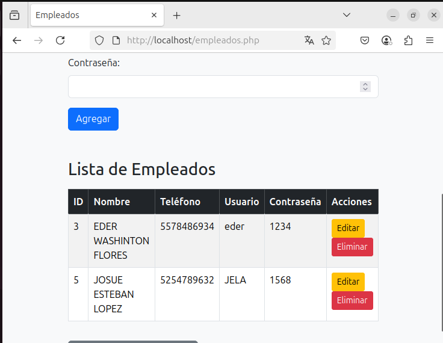
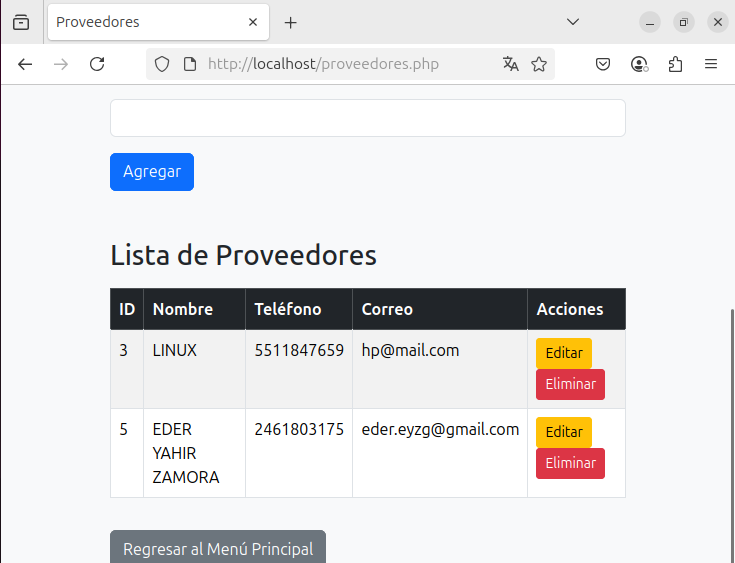
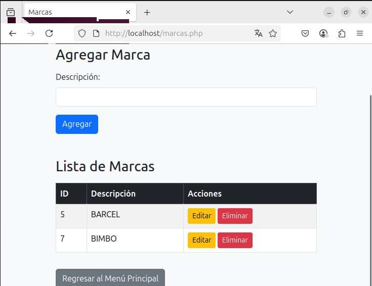
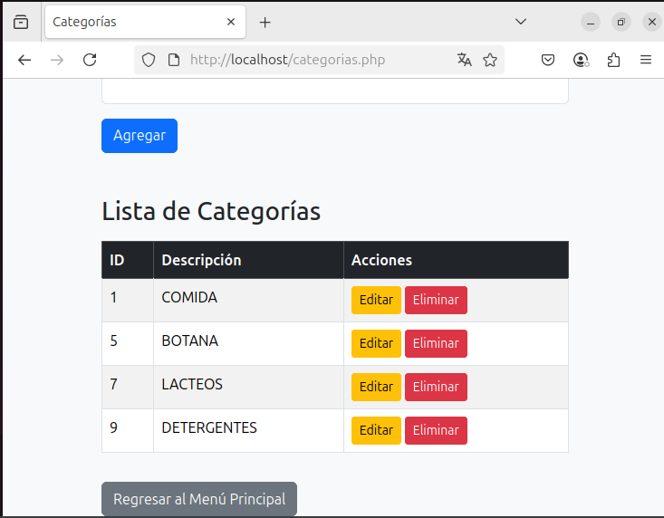
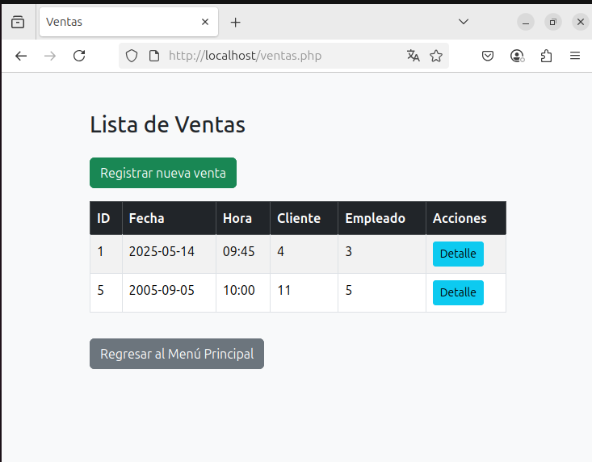
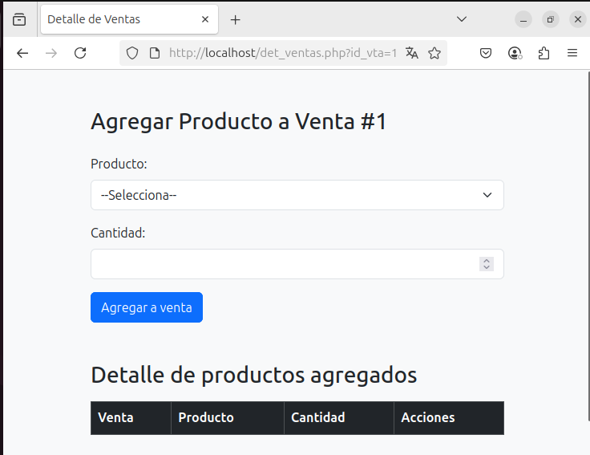

# TiendaBD - Sistema de Gestión CRUD

Este proyecto es un sistema CRUD desarrollado en PHP y MySQL para la gestión de una tienda. Permite administrar:

- Clientes 
- Empleados 
- Proveedores
- Productos
- Marcas 
- Categorías
- Ventas

## Capturas de Pantalla

### Menú Principal


### Módulo de Clientes


### Módulo de Productos


### Módulo de Empleados


### Módulo de Proveedores


### Módulo de Marcas


### Módulo de Categorias


### Módulo de Ventas


### Módulo de Detalle Ventas


## 🚀 Requisitos
- Servidor Apache
- PHP 7.x o 8.x
- MySQL o MariaDB

## 🛠️ Instalación

1. Clona el repositorio:
```bash
git clone https://github.com/tu_usuario/TiendaBD.git
